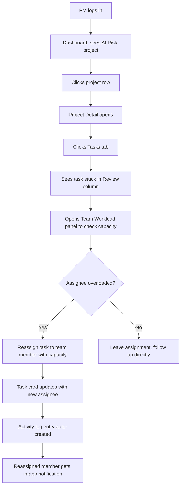
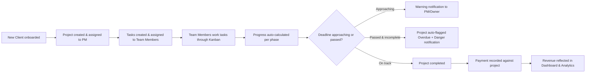
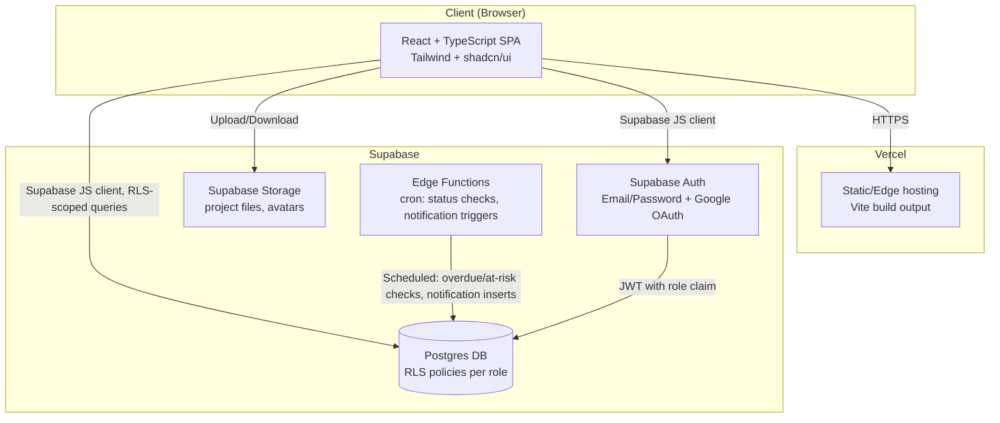
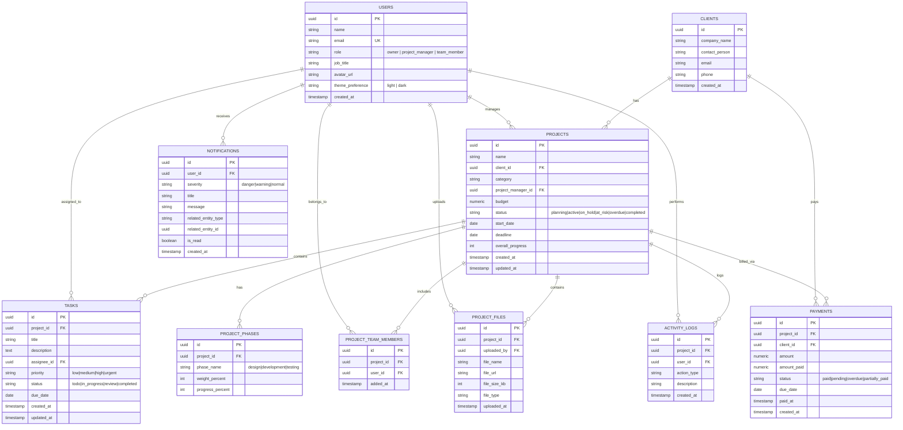
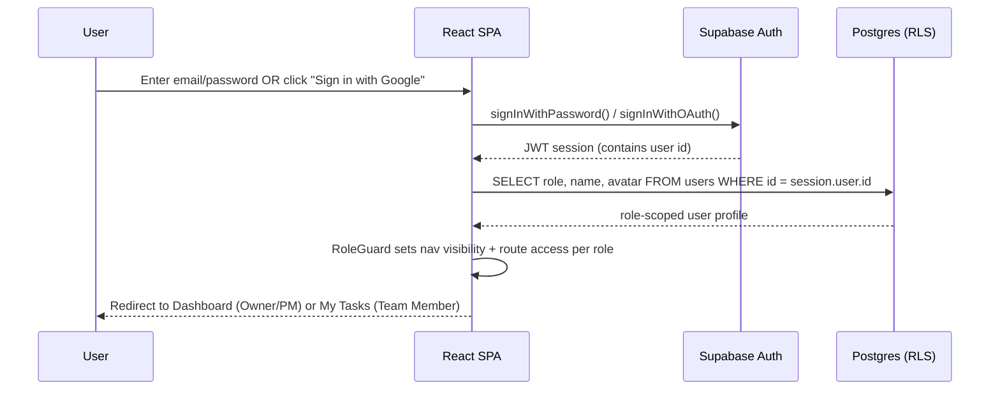
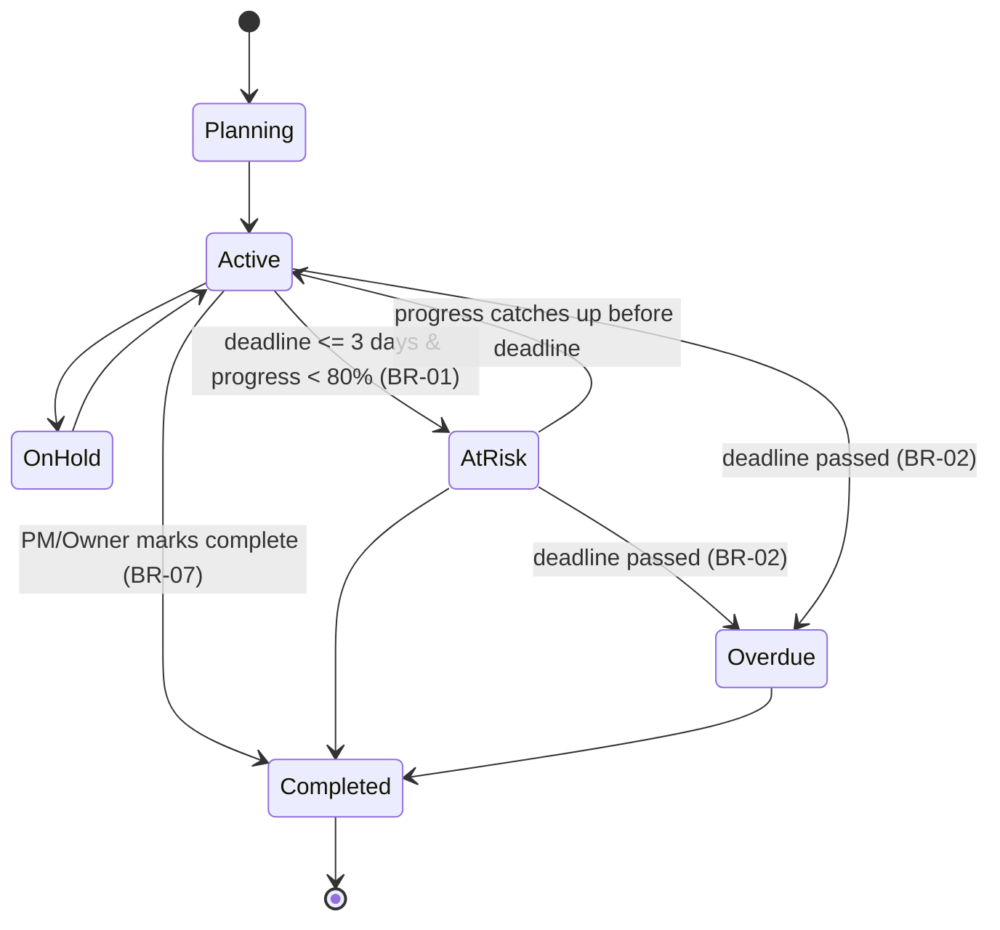
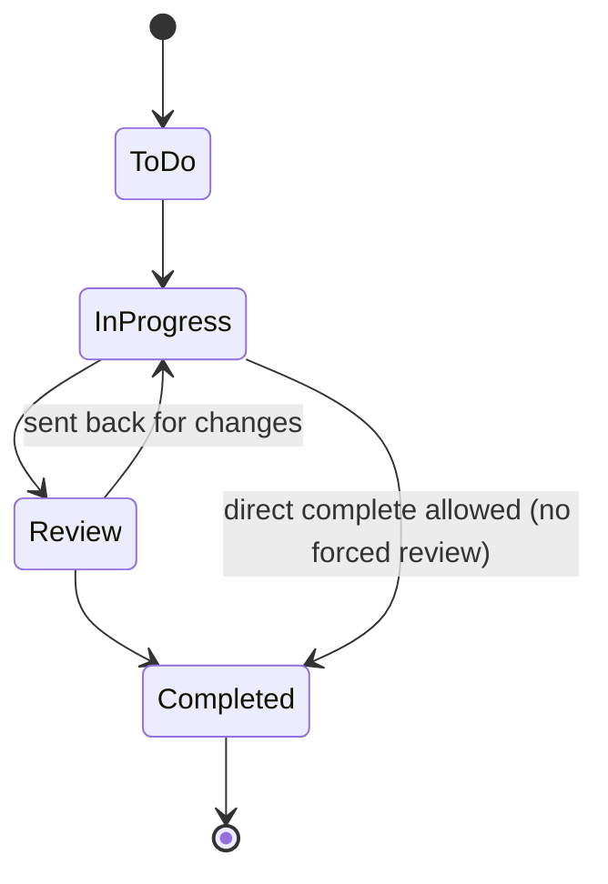
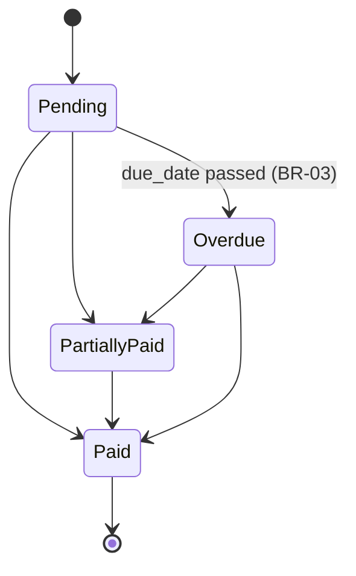
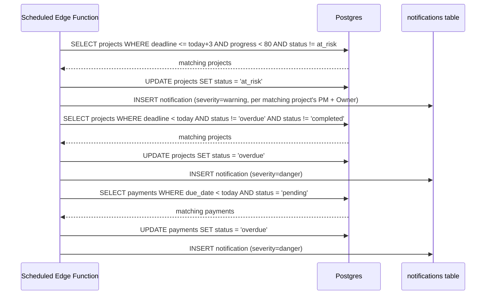
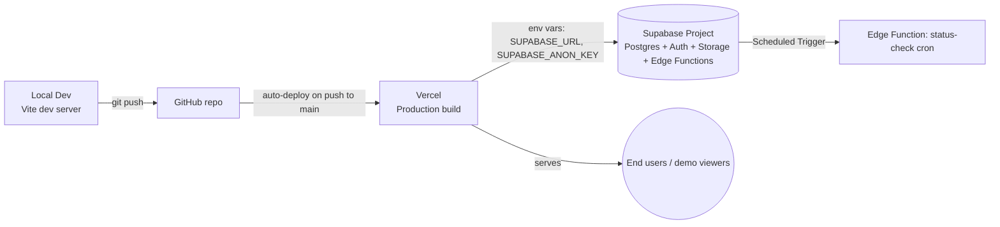

# Product Requirements Document — AgencyOS

**Version:** 1.0
**Date:** July 20, 2026
**Author:** Hanif (Product Owner / Designer / Developer)
**Document status:** Draft for build — vibe coding exploration project
**Scope calibration:** Lightweight–Medium (single-tenant, 3-role RBAC, no payment gateway integration, no client portal)

---

## 1. Executive Summary

AgencyOS is a personal design-and-build exploration project: a fully functional internal operations dashboard for a fictional-but-realistic digital creative agency ("Bantuinonline Agency"), designed and implemented end-to-end by Hanif as a **vibe coding** exercise — using AI coding agents to turn a UI/UX design into working, deployed software.

The product itself is an agency project-management dashboard that centralizes projects, tasks, clients, team workload, finance, and analytics into one workspace, replacing the scattered spreadsheet/chat/DM workflow that real agencies commonly struggle with. The brief is written with the rigor of a real client engagement so that the resulting build is strong enough to present as a genuine product case study — not a static Figma mockup with placeholder data.

The primary "user" of this PRD is an AI coding agent (Claude Code or similar) that will implement the product from this document with minimal further clarification.

---

## 2. Business Background

Hanif is a UI/UX Designer at Bantuinonline and Associate Founder of Deepverse Team, currently building a portfolio around dashboard/data-dense UI design and AI-assisted ("vibe coding") development workflows. AgencyOS is not a commissioned product for a real client or employer — it is a self-directed exploration project that uses a realistic digital-agency operations brief as its grounding scenario, so that the resulting case study demonstrates:

1. Ability to design a complex, data-dense B2B dashboard (not just marketing/landing pages)
2. Ability to translate that design into a working, deployed application using AI coding tools
3. Ability to reason like a product team — business rules, permissions, data modeling — not just visual design

The "client" (Bantuinonline Agency) and its problems described below are treated as real for the purposes of requirements-gathering, so the resulting PRD and product are held to the same bar as an actual client engagement.

---

## 3. Problem Statement

Digital agencies — including the fictional Bantuinonline Agency used as this project's scenario — typically run operations across a patchwork of disconnected tools: spreadsheets for budgets, chat apps for status updates, a project management tool for tasks, and manual tracking for payments. This creates four concrete problems:

1. **Fragmented information** — project data lives in spreadsheets, chat, email, Figma, and PM tools simultaneously, so no single source of truth exists.
2. **Poor status visibility** — managers cannot quickly answer "which projects are active, near deadline, or overdue?" without manually cross-referencing multiple sources.
3. **No business performance view** — revenue, budget, and service-line performance are not available in one place, making data-driven decisions slow.
4. **Invisible team workload** — project managers cannot see who is overloaded, who has capacity, or whose tasks are approaching deadline.

---

## 4. Objectives & Goals

| # | Objective | Type |
|---|---|---|
| O1 | Design and ship a data-dense, multi-role SaaS-style dashboard that goes beyond typical portfolio pieces (landing pages, mobile app UI) | Design practice |
| O2 | Practice and demonstrate a full vibe-coding workflow: PRD → design → AI-assisted implementation → deployment | Technical practice |
| O3 | Centralize project, client, task, team, and finance data into one workspace (in-scenario business goal) | Product goal |
| O4 | Give the fictional agency's PM/Owner instant visibility into project status, deadlines, and team workload | Product goal |
| O5 | Produce a deployed, walkable, end-to-end artifact suitable for a portfolio case study | Career/portfolio goal |

---

## 5. Success Metrics

Because this is an exploration/portfolio project rather than a live business, success is measured against build completeness and case-study quality rather than commercial KPIs.

**North Star:** A fully deployed, publicly accessible instance of AgencyOS where all three roles (Owner, Project Manager, Team Member) can log in and experience genuinely different, permission-correct views of real (seeded) data.

| Metric | Target |
|---|---|
| Phase 1-4 features functional against real data (not static) | 100% |
| Roles with enforced, verifiably different permissions | 3 / 3 |
| Core Web Vitals - Largest Contentful Paint | < 2.5s on 4G |
| Lighthouse Accessibility score | >= 90 |
| Lighthouse Performance score | >= 85 |
| Dashboard query response time (seeded dataset: ~50 projects, ~500 tasks) | < 500ms |
| Case study published (design rationale + working demo link) | Yes/No |

---

## 6. Stakeholders

| Stakeholder | Role in this project |
|---|---|
| Hanif | Product Owner, Product Designer, Developer (AI-assisted) - single-person project |
| Bantuinonline Agency (fictional/scenario) | In-scenario client - used to ground requirements realistically; not a real commissioning party |
| AI coding agent (Claude Code, etc.) | Implementation partner - primary reader of this PRD |

---

## 7. Assumptions

Flagged explicitly since the original brief did not specify these; the AI coding agent should treat these as defaults unless a future revision of this PRD overrides them.

1. **Single tenant** - AgencyOS serves one agency (Bantuinonline) only. No multi-agency / multi-workspace switching.
2. **No client portal** - Clients are data records managed by internal staff; clients do not log in or have accounts.
3. **Permission model**: Owner has full access to everything, including Finance and Team management (add/remove members). Project Manager has full CRUD on Projects/Tasks/Clients and can view (but not fully administer) Finance; cannot create/deactivate Team accounts. Team Member can only view projects/tasks they're assigned to and update the status of their own tasks; cannot view project budget/revenue or Finance/Analytics/Client contact data.
4. **Status automation**: A project is automatically flagged **At Risk** when its deadline is <= 3 days away AND overall progress is < 80%. A project is automatically flagged **Overdue** when its deadline date has passed and status is not `Completed`.
5. **Notifications** are in-app only for V1 (no email/WhatsApp delivery).
6. **Finance module** tracks payment status manually (Paid / Pending / Overdue / Partially Paid) entered by Owner/PM; it is **not** connected to a real payment gateway (no Midtrans/Xendit integration).
7. **File storage** uses Supabase Storage, 25MB max per file, common document/image/design file types (pdf, png, jpg, fig-link, docx, xlsx, zip).
8. **Currency** is Indonesian Rupiah (IDR), displayed with `Rp` prefix and thousands separators. **UI language** is English.
9. **No production-grade compliance** (SOC2, audit trails beyond a basic activity log) is required given the exploration nature of the project.

---

## 8. Scope

**In scope (V1 - build in this PRD):**
- Full authentication (email/password + Google OAuth) with 3 roles
- Dashboard with KPIs, project performance table, revenue chart, upcoming deadlines, team workload
- Projects module: list, filters/search, create, detail page with progress tracking, tabs (Overview, Tasks, Timeline, Team, Files, Activity)
- Tasks: Kanban board, create/assign/reprioritize/status change
- Clients: list, detail, project relationship, spending
- Team: member list, workload, availability
- Finance: revenue, invoices/payment status tracking (manual), budget vs. spend per project
- Analytics: project performance, service-line performance, team performance
- In-app notification system (Danger/Warning/Normal)
- Responsive layout, dark mode, loading/empty/error states

**Out of Scope (explicitly deferred - see Section 9):** multi-tenant support, client-facing portal, real payment gateway integration, email/WhatsApp notification delivery.

---

## 9. Out of Scope

| Item | Reason | Revisit? |
|---|---|---|
| Multi-tenant / multiple agencies | Single-tenant exploration project | Not planned |
| Client-facing login/portal | Not part of original brief; adds significant auth complexity | V2 candidate |
| Real payment gateway (Midtrans/Xendit) | Finance is illustrative/manual tracking for this build | V2 candidate |
| Email / WhatsApp notification delivery | In-app notifications sufficient for demo purposes | V2 candidate (WhatsApp likely high-value for real Indonesian agencies) |
| Native mobile app | Web-responsive is sufficient | Not planned |
| Offline mode / PWA | Not required for a portfolio demo | Not planned |
| SSO / enterprise auth (SAML, Okta) | Overkill for single-tenant scope | Not planned |
| Approval workflow before marking project "Completed" | Open question from discovery - deferred, PM/Owner can mark complete directly in V1 | Revisit if feedback suggests it's needed |
| Whether Team Members see project budget | Open question - current default is **hidden** (see Permission Matrix, Section 15) | Adjustable via Settings in future |

## 10. Target Users

| Role | Who | Primary needs |
|---|---|---|
| **Agency Owner** | Business owner/leadership | Revenue, profitability, service-line performance, team health, high-level decision-making data |
| **Project Manager** (primary) | Runs day-to-day delivery | Project progress, task assignment, client communication, team workload, deadlines |
| **Team Member** | Designer/developer/marketer executing work | Their own task list, deadlines, project context for what they're assigned to |

## 11. User Personas

**Persona 1 - Dinda, Agency Owner**
- 34, runs Bantuinonline Agency with ~15 staff across 4 service lines.
- Checks AgencyOS every morning for revenue trend and any overdue/at-risk projects before her first meeting.
- Pain point today: has to ask her PM for a verbal status update because there's no single source of truth.
- Primary screens: Dashboard, Finance, Analytics.

**Persona 2 - Rangga, Project Manager**
- 28, manages 5-8 concurrent projects across different clients.
- Needs to reassign tasks quickly when a team member is overloaded, and wants deadline visibility without digging through Slack threads.
- Primary screens: Projects, Tasks (Kanban), Team, Project Detail.

**Persona 3 - Sarah, Team Member (UI/UX Designer)**
- 24, works on 2-3 projects simultaneously.
- Wants a simple, focused view: "what do I need to do today, and when is it due" - not the full agency's data.
- Primary screens: My Tasks (filtered Kanban), Project Detail (read-only for non-assigned areas).

## 12. Customer / User Journey

**Journey - Project Manager's week:**
1. Monday morning: opens Dashboard, sees 3 projects flagged At Risk and 2 Overdue.
2. Clicks into the At Risk project, checks the Tasks tab, sees 4 tasks stuck in "Review."
3. Reassigns a stalled task to a team member with lower workload (checked via Team Workload panel).
4. Updates project status/notes in Activity tab so the change is logged.
5. Throughout the week, receives in-app Warning notifications as new deadlines approach and Danger notifications if something becomes overdue.
6. Friday: checks Analytics to see which service line is most profitable this month for the Owner's weekly sync.

## 13. Jobs To Be Done

- When I start my day, I want to see which projects need my attention first, so I can prioritize without checking five different tools.
- When a deadline is approaching, I want to be notified automatically, so nothing slips through unnoticed.
- When I assign a task, I want to see who already has too much on their plate, so I don't overload one person.
- When the Owner asks "how are we doing," I want an Analytics view I can screenshot or reference immediately, rather than compiling a report.
- When I'm a Team Member, I want a task list scoped to just me, so I'm not overwhelmed by agency-wide data I can't act on.

## 14. Pain Points (current state, pre-AgencyOS)

| Pain point | Impact |
|---|---|
| Project data scattered across spreadsheet, chat, email, Figma, PM tool | Time lost searching; conflicting "source of truth" |
| No automatic at-risk/overdue flagging | Deadlines are missed reactively instead of caught proactively |
| Revenue/budget/service performance not centralized | Owner decisions are delayed or based on gut feel |
| No visibility into team workload | Uneven task distribution, burnout risk on overloaded members |

---

## 15. Feature Prioritization

| Feature | Priority | Phase |
|---|---|---|
| Authentication (email/password + Google OAuth), 3 roles | Must | 1 |
| Dashboard (KPIs, project table, revenue chart, deadlines, workload) | Must | 1 |
| Projects: list, filter, search, create, detail, progress tracking | Must | 2 |
| Tasks: Kanban board, create, assign, status/priority change | Must | 3 |
| Clients: list, detail, project relationship | Must | 4 |
| Team: member list, workload, availability | Should | 4 |
| Finance: revenue tracking, payment status | Should | 4 |
| Analytics: project/service/team performance | Should | 5 |
| In-app notifications (Danger/Warning/Normal) | Should | 5 |
| Dark mode, responsive, loading/empty/error states | Must | 5 |
| Client-facing portal | Won't (V1) | V2 |
| Payment gateway integration | Won't (V1) | V2 |
| Email/WhatsApp notifications | Won't (V1) | V2 |

---

## 16. Functional Requirements

Every feature below is written to the quality bar: business goal, functional requirement, acceptance criteria, edge cases, validation rules, permission rules, error states, success states, dependencies.

### 16.1 Authentication & Authorization

**FR-AUTH-01: Sign up / Log in**
- **Business goal:** Only authorized agency staff can access agency data.
- **Functional requirement:** Users authenticate via email/password or Google OAuth (Supabase Auth). New accounts are created by an Owner via Team Management (Section 16.6) - there is no public self-service sign-up, since this is an internal tool.
- **Acceptance criteria:** A user with valid credentials reaches the Dashboard within 2 requests (auth call + session fetch). An invalid credential attempt shows an inline error without revealing whether the email exists.
- **Edge cases:** Google OAuth email doesn't match any invited user -> show "This Google account isn't linked to an AgencyOS user. Contact your Owner." and block session creation. Session token expired mid-use -> silently refresh via Supabase refresh token; if refresh fails, redirect to login with a "Session expired" toast.
- **Validation rules:** Email must be valid format; password minimum 8 characters, at least 1 number.
- **Permission rules:** N/A (pre-auth).
- **Error states:** "Incorrect email or password", "Account not found", "Too many attempts - try again in 5 minutes" (after 5 failed attempts, 5-minute lockout).
- **Success states:** Redirect to role-appropriate default landing (Owner/PM -> Dashboard; Team Member -> My Tasks view).
- **Dependencies:** Supabase Auth configured with Google OAuth provider; `users` table with `role` column.

**FR-AUTH-02: Role-based route protection**
- **Business goal:** Enforce the permission model (Section 7, Assumption 3) at the routing/API layer, not just visually.
- **Functional requirement:** Every route and API call checks the requesting user's role via Supabase Row Level Security (RLS) policies plus a client-side route guard for UX (hiding nav items the role can't use).
- **Acceptance criteria:** A Team Member manually navigating to `/finance` is redirected to a 403 "Not authorized" page, not just a hidden nav link. Direct API calls (e.g. via browser devtools) to restricted tables are rejected server-side by RLS regardless of client-side UI state.
- **Edge cases:** Role changed while user has an active session -> next API call re-evaluates RLS against current role (RLS reads live role from `users` table, not a stale JWT claim).
- **Validation rules:** N/A.
- **Permission rules:** See full Permission Matrix, Section 20.
- **Error states:** 403 page with "You don't have access to this section" + link back to allowed home.
- **Success states:** N/A.
- **Dependencies:** FR-AUTH-01, Supabase RLS policies per table.

### 16.2 Dashboard

**FR-DASH-01: KPI Cards**
- **Business goal:** Give Owner/PM an instant read on agency health (O4).
- **Functional requirement:** Display 4 cards: Total Revenue (sum of `payments` where status=Paid, current month, with % change vs. previous month), Active Projects (count where status in [Active, At Risk]), Pending Tasks (count where status != Completed), Overdue Projects (count where status=Overdue).
- **Acceptance criteria:** Cards recalculate on page load and reflect the seeded dataset accurately (verifiable by manually cross-checking counts in the Projects/Tasks tables).
- **Edge cases:** Zero projects/tasks -> show "0" with no percentage change (avoid divide-by-zero on % calc, show "-" instead of "NaN%").
- **Validation rules:** N/A (read-only aggregation).
- **Permission rules:** Owner, PM see all 4 cards. Team Member's dashboard (My Tasks view) does not show these agency-wide cards.
- **Error states:** If the aggregation query fails, show a card-level inline error ("Couldn't load") rather than blocking the whole dashboard.
- **Success states:** Numbers render with correct IDR formatting (e.g. `Rp 84.250.000`) and a colored delta badge (green up / red down).
- **Dependencies:** `projects`, `tasks`, `payments` tables populated.

**FR-DASH-02: Project Performance Table**
- **Business goal:** Fast visual scan of top projects without opening each one (O4).
- **Functional requirement:** Table showing Project, Client, Progress (bar), Deadline, Status for the 5 most urgent projects (sorted by soonest deadline among non-completed projects).
- **Acceptance criteria:** Sort order updates correctly as deadlines change; clicking a row navigates to that Project Detail page.
- **Edge cases:** Fewer than 5 active projects -> show only what exists, no empty placeholder rows. All projects completed -> show empty state "No active projects right now."
- **Validation rules:** N/A.
- **Permission rules:** Owner/PM see all projects. Team Member does not see this table on their landing view.
- **Error states:** Row-level: if client relation is missing/deleted, show "Client removed" instead of breaking the row.
- **Success states:** Status badge color-coded (Planning=gray, Active=blue, On Hold=yellow, At Risk=orange, Overdue=red, Completed=green).
- **Dependencies:** FR-PROJ-01, status automation logic (Assumption 4).

**FR-DASH-03: Revenue Analytics Chart**
- **Business goal:** Visualize revenue trend to support Owner decision-making (O4).
- **Functional requirement:** Line/bar chart (Recharts) of revenue over time, filterable by 7 Days / 30 Days / 3 Months / 6 Months / 1 Year, toggle between "By Month," "By Project," "By Service."
- **Acceptance criteria:** Switching filters re-queries and re-renders within 500ms for the seeded dataset; the sum across the visible period matches the KPI card for the equivalent period.
- **Edge cases:** No revenue data in selected range -> show empty chart state with message, not a broken axis.
- **Validation rules:** N/A.
- **Permission rules:** Owner/PM only.
- **Error states:** Chart-level "Couldn't load revenue data" inline error with retry button.
- **Success states:** Chart renders with IDR-formatted axis labels and tooltips.
- **Dependencies:** `payments` table, FR-DASH-01.

**FR-DASH-04: Upcoming Deadlines & Team Workload panels**
- **Business goal:** Surface time-sensitive information proactively (O4, JTBD "see what needs attention first").
- **Functional requirement:** Upcoming Deadlines lists the next 5 project/task deadlines within 14 days, soonest first, with "Due in N days" label. Team Workload lists each team member with their open task count, sorted descending.
- **Acceptance criteria:** A deadline exactly 14 days out is included; 15 days out is excluded. Workload counts match the actual count of non-completed tasks assigned to that member.
- **Edge cases:** No upcoming deadlines within 14 days -> "Nothing due soon" empty state. Team member with 0 tasks -> shown with "0 Tasks," not omitted (so overload imbalance is visible).
- **Validation rules:** N/A.
- **Permission rules:** Owner/PM see agency-wide panels. Team Member sees only their own upcoming deadlines (no workload panel, since it's not relevant to them).
- **Error states:** Inline panel-level error, doesn't block rest of dashboard.
- **Success states:** Clicking a deadline item navigates to the relevant project/task.
- **Dependencies:** `tasks`, `projects`, `users` tables.

### 16.3 Projects Module

**FR-PROJ-01: Project List (All / Active / Completed)**
- **Business goal:** Centralize project visibility (O3, O4).
- **Functional requirement:** Paginated table/grid of projects with columns: Name, Client, Category, Project Manager, Budget, Progress, Deadline, Status. Tabs for All / Active / Completed. Search by project name or client name. Filters: status, category, project manager, date range.
- **Acceptance criteria:** Search returns matches within 300ms (debounced input) for the seeded dataset. Filters are combinable (e.g. status=Active AND category=Web Development).
- **Edge cases:** No results match filter/search -> empty state with "Clear filters" action. Very long project names truncate with ellipsis + full name on hover.
- **Validation rules:** N/A (read).
- **Permission rules:** Owner/PM see all projects. Team Member sees only projects they're assigned to (via `project_team_members`), with Budget column hidden.
- **Error states:** Failed fetch -> full-page inline error with retry.
- **Success states:** N/A.
- **Dependencies:** `projects`, `clients`, `users` tables.

**FR-PROJ-02: Create Project**
- **Business goal:** Get new work into the system as the single source of truth from day one (O3).
- **Functional requirement:** Form to create a project: Name (required), Client (required, select existing or "+ New Client" inline), Category (select: UI/UX Design, Web Development, Mobile App Development, Branding, Social Media Design, Digital Marketing), Project Manager (required, select from Owner/PM-role users), Budget (required, IDR, numeric), Start Date (required), Deadline (required, must be after Start Date), initial Status (defaults to "Planning").
- **Acceptance criteria:** Submitting a valid form creates a `projects` row and redirects to the new Project Detail page. All required fields are enforced before submit is enabled.
- **Edge cases:** Deadline before Start Date -> inline validation error, submit blocked. Budget of 0 -> allowed but shows a confirmation ("Budget is Rp 0 - continue?") since it's unusual but not invalid. Duplicate project name for the same client -> allowed (not unique), but a soft warning is shown ("A project with this name already exists for this client").
- **Validation rules:** Name 3-100 chars. Budget >= 0, numeric only. Start Date and Deadline valid calendar dates.
- **Permission rules:** Owner, Project Manager can create. Team Member cannot (button hidden + API rejects).
- **Error states:** "Couldn't create project, please try again" toast on server failure; form data preserved (not cleared) on failure.
- **Success states:** Toast "Project created" + redirect.
- **Dependencies:** `clients`, `users` tables must have selectable data (at least one PM-role user must exist).

**FR-PROJ-03: Project Detail - Header & Progress**
- **Business goal:** Single-page command center for a project (O3, O4).
- **Functional requirement:** Header shows Name, Client, Status badge, Start Date, Deadline, Budget (hidden for Team Member), Project Manager. Progress section shows Overall Progress % (computed as weighted average of phase progress: Design 30%, Development 50%, Testing 20% - weights configurable per project category) plus per-phase progress bars (Design/Development/Testing).
- **Acceptance criteria:** Overall Progress recalculates automatically whenever a phase's progress or a task's status changes (task completion contributes to phase progress). Progress bar visually matches the stored percentage exactly.
- **Edge cases:** Project with zero tasks -> Overall Progress shows 0% with a note "No tasks yet." Phase with zero tasks -> excluded from weighted average (redistribute weight proportionally among phases that have tasks).
- **Validation rules:** Progress values clamp to 0-100.
- **Permission rules:** Owner/PM can edit status/dates/budget/PM assignment. Team Member: read-only, and Budget field is not rendered at all (not just visually hidden - excluded from the API response for that role).
- **Error states:** Failed to save edit -> inline field-level error, other fields retain unsaved state.
- **Success states:** Autosave indicator ("Saved") on successful field edit.
- **Dependencies:** FR-TASK-* (task status drives phase progress), `project_phases` table.

**FR-PROJ-04: Project Detail Tabs (Overview, Tasks, Timeline, Team, Files, Activity)**
- **Business goal:** Organize dense project information without overwhelming a single page (design goal O1).
- **Functional requirement:** Overview = summary + description + key dates. Tasks = embedded Kanban scoped to this project (see FR-TASK-01). Timeline = chronological view of milestones/deadlines. Team = list of assigned members with role-on-project and quick reassign. Files = upload/list/download project files (Supabase Storage). Activity = chronological log of changes (status changes, task completions, file uploads, member additions) - auto-generated, not manually written.
- **Acceptance criteria:** Each tab lazy-loads its data only when clicked (not all on initial page load) to keep the page fast. Activity log entries are immutable and timestamped.
- **Edge cases:** Files tab: upload exceeding 25MB -> rejected client-side before upload starts, with clear error. Empty Activity log (new project) -> "No activity yet" state.
- **Validation rules:** File types allowed: pdf, png, jpg, jpeg, docx, xlsx, zip. Max 25MB per file.
- **Permission rules:** Team Member: Files (view/download + upload own work), Activity (view only), Team (view only, no reassign), Timeline (view only). Owner/PM: full control on all tabs.
- **Error states:** File upload failure -> retry button, doesn't lose other uploaded files in the same batch.
- **Success states:** File upload shows progress bar then appears in list; activity log entry auto-created for every meaningful action.
- **Dependencies:** Supabase Storage bucket configured, `project_files`, `activity_logs` tables.

### 16.4 Tasks Module

**FR-TASK-01: Kanban Board**
- **Business goal:** Give teams a familiar, fast way to track work-in-progress (O3, JTBD "what do I need to do today").
- **Functional requirement:** Kanban board with columns To Do / In Progress / Review / Completed. Cards show task title, assignee avatar, priority badge (Low/Medium/High/Urgent, color-coded), due date. Drag-and-drop between columns updates status. Board can be viewed agency-wide (Owner/PM, filterable by project/assignee) or scoped to a single project (embedded in Project Detail > Tasks tab) or scoped to "My Tasks" (Team Member's default view, auto-filtered to their own assignee ID).
- **Acceptance criteria:** Dragging a card to a new column persists the status change immediately (optimistic UI update, rolled back on server error). Column counts update in real time as cards move.
- **Edge cases:** Dragging a task to "Completed" when it has unresolved sub-requirements is still allowed (no blocking dependency logic in V1) but triggers the phase-progress recalculation (FR-PROJ-03). Two users dragging the same card simultaneously -> last write wins, with a toast "This task was updated elsewhere" if the local state was stale.
- **Validation rules:** Status transitions are unrestricted (any column to any column) - no enforced linear workflow in V1.
- **Permission rules:** Owner/PM can move/edit any task. Team Member can only move/edit tasks where they are the assignee; dragging a card not assigned to them is disabled (card shows a "not yours" cursor state).
- **Error states:** Failed status update -> card snaps back to original column + toast "Couldn't update task."
- **Success states:** Card animates into new column position; if moved to Completed, a subtle success indicator (checkmark flash).
- **Dependencies:** `tasks` table, FR-PROJ-03 (progress recalculation).

**FR-TASK-02: Create / Edit Task**
- **Business goal:** Capture actionable work items tied to a project (O3).
- **Functional requirement:** Form with Title (required), Description (optional, rich text or plain), Project (required, pre-filled if created from within a project), Assignee (required, select from users on that project's team), Priority (required, default Medium), Due Date (required), Status (default To Do).
- **Acceptance criteria:** Task appears in the correct Kanban column and correct project immediately after creation.
- **Edge cases:** Due date in the past -> allowed but shows a warning badge "Overdue" immediately upon creation. Assignee not yet added to the project's team -> creating the task auto-adds them to `project_team_members`.
- **Validation rules:** Title 3-150 chars. Due Date must be a valid date (no upper/lower bound restriction relative to project dates in V1 - flagged as a soft business rule, not hard-enforced).
- **Permission rules:** Owner/PM can create/edit any task's full fields. Team Member can edit Status and add comments/activity notes on their own tasks only, not reassign or change priority.
- **Error states:** Inline field validation errors; server error -> toast with retry, form data preserved.
- **Success states:** Toast "Task created" / "Task updated."
- **Dependencies:** FR-PROJ-04 (Team tab), `users`, `projects` tables.

### 16.5 Clients Module

**FR-CLI-01: Client List & Detail**
- **Business goal:** Track client relationships and spending alongside project data (O3).
- **Functional requirement:** List: Company Name, Contact Person, Email, Phone, Active Projects count, Total Revenue, Payment Status summary. Detail page: full contact info, list of all projects (past + active) for that client, total spend, payment history.
- **Acceptance criteria:** Total Revenue on both list and detail matches the sum of that client's `payments` where status=Paid.
- **Edge cases:** Client with zero projects (newly added) -> detail page shows "No projects yet" with a "+ New Project" shortcut. Deleting a client with active projects -> blocked with an error explaining the project(s) must be reassigned or archived first.
- **Validation rules:** Email valid format; Phone numeric/formatted (Indonesian format accepted, e.g. `+62...` or `08...`).
- **Permission rules:** Owner/PM full CRUD. Team Member: no access to Clients module at all (nav item hidden, route guarded).
- **Error states:** Duplicate email on create -> inline error "A client with this email already exists."
- **Success states:** Toast on create/update/delete.
- **Dependencies:** `clients`, `projects`, `payments` tables.

### 16.6 Team Module

**FR-TEAM-01: Team Member List, Workload, Availability**
- **Business goal:** Make workload visible to prevent overload (O4, pain point "invisible team workload").
- **Functional requirement:** List of all users with Name, Role, Active Projects count, Assigned (open) Tasks count, Availability % (computed as `100 - (open tasks weighted by priority / capacity threshold * 100)`, clamped 0-100; capacity threshold default = 15 open tasks = 0% availability).
- **Acceptance criteria:** Availability % recalculates whenever a task is assigned, completed, or reassigned to/from that member.
- **Edge cases:** Member with 0 tasks -> 100% availability. Member exceeding capacity threshold -> 0% availability shown with a red "Overloaded" badge, not a negative number.
- **Validation rules:** N/A (computed field).
- **Permission rules:** Owner/PM view all. Owner can also create/deactivate user accounts and change roles; PM cannot. Team Member sees only their own row (no agency-wide roster) - or the module is hidden entirely from their nav.
- **Error states:** N/A (read-mostly module).
- **Success states:** N/A.
- **Dependencies:** `users`, `tasks`, `project_team_members` tables.

**FR-TEAM-02: Invite / Create Team Member Account**
- **Business goal:** Onboard new staff into the system (since there's no public sign-up, per FR-AUTH-01).
- **Functional requirement:** Owner-only form: Name, Email, Role (Owner/Project Manager/Team Member), Job Title. Creates a `users` row and sends a Supabase Auth invite (magic link) to set their password, or the user can subsequently log in via Google OAuth using the same email.
- **Acceptance criteria:** Invited user appears in Team list immediately with a "Pending" status until they complete first login.
- **Edge cases:** Inviting an email already in the system -> blocked with "User already exists."
- **Validation rules:** Email valid and unique across `users`.
- **Permission rules:** Owner only. PM and Team Member cannot access this form (button/route hidden and guarded).
- **Error states:** "Couldn't send invite, please try again."
- **Success states:** Toast "Invite sent to {email}."
- **Dependencies:** Supabase Auth admin invite capability.

### 16.7 Finance Module

**FR-FIN-01: Revenue, Invoices, Payment Status**
- **Business goal:** Centralize financial visibility for the Owner (O4, pain point "no business performance view").
- **Functional requirement:** Summary cards: Total Revenue, Paid, Pending, Overdue (sums of `payments` by status). Table of payment records: Project, Client, Amount, Status (Paid/Pending/Overdue/Partially Paid), Due Date, Paid Date. Owner/PM can manually record a payment against a project and update its status.
- **Acceptance criteria:** Marking a payment "Paid" sets `paid_at` to the current timestamp and immediately updates the Dashboard revenue KPI (FR-DASH-01) and client Total Revenue (FR-CLI-01).
- **Edge cases:** Partially Paid status requires entering a partial `amount_paid` value less than the full invoice amount; the remaining balance is auto-calculated and displayed. Marking a payment Overdue is automatic when `due_date` passes and status is still Pending (system job, not manual).
- **Validation rules:** Amount > 0. Amount Paid (for Partially Paid) must be > 0 and < Amount.
- **Permission rules:** Owner: full CRUD. Project Manager: can view all + create/update payment status. Team Member: no access.
- **Error states:** "Couldn't update payment status, please try again."
- **Success states:** Toast + status badge updates instantly.
- **Dependencies:** `payments`, `projects`, `clients` tables.

### 16.8 Analytics Module

**FR-ANL-01: Project, Service, and Team Performance**
- **Business goal:** Support data-driven decisions (O4).
- **Functional requirement:** Project Performance: count of Completed vs. Delayed projects, average completion time (days from Start Date to actual completion). Service Performance: revenue grouped by Category (bar chart, e.g. UI/UX Design vs. Web Development vs. Branding). Team Performance: tasks completed per member, average completion time per member, project contribution count.
- **Acceptance criteria:** All three views are filterable by date range (same filter set as FR-DASH-03: 7D/30D/3M/6M/1Y).
- **Edge cases:** No completed projects in range -> "Not enough data yet" empty state rather than a broken chart.
- **Validation rules:** N/A (read-only aggregation).
- **Permission rules:** Owner/PM only. Team Member has no access to this module.
- **Error states:** Per-chart inline error with retry, doesn't block other charts on the page.
- **Success states:** N/A.
- **Dependencies:** `projects`, `tasks`, `payments`, `users` tables.

### 16.9 Notification System

**FR-NOTIF-01: In-app Notifications (Danger / Warning / Normal)**
- **Business goal:** Proactively surface time-sensitive issues (JTBD "notify me automatically").
- **Functional requirement:** Bell icon with unread count badge in header. Notifications generated automatically by system triggers:
  - **Danger:** project becomes Overdue; a payment becomes Overdue; (future: "critical issue" manual flag by PM/Owner).
  - **Warning:** project/task deadline within 3 days; project progress < 50% with deadline within 7 days ("low progress"); task created with no assignee ("unassigned task").
  - **Normal:** new project created; task marked Completed; new client added.
- **Acceptance criteria:** A notification is created within the same transaction/request as the triggering event (e.g. marking a project Overdue via the daily status-check job also inserts a Danger notification for the assigned PM and Owner).
- **Edge cases:** Same trigger firing repeatedly (e.g. still overdue tomorrow) -> do not duplicate; only notify once per state transition, not once per day.
- **Validation rules:** N/A (system-generated).
- **Permission rules:** Users only receive notifications relevant to their scope (Team Member: only their own tasks/projects; Owner/PM: agency-wide).
- **Error states:** N/A.
- **Success states:** Clicking a notification navigates to the relevant entity and marks it read. "Mark all as read" action available.
- **Dependencies:** `notifications` table, a scheduled job (Supabase Edge Function on a cron schedule) for time-based triggers like deadline-approaching and overdue checks.

### 16.10 Settings

**FR-SET-01: Profile & Preferences**
- **Business goal:** Basic account self-service.
- **Functional requirement:** Users can update their own Name, Avatar, Job Title, and toggle Dark/Light mode (persisted per-user).
- **Acceptance criteria:** Theme preference persists across sessions (stored in `users.theme_preference` or local profile record, not browser-only storage, so it's consistent across devices).
- **Edge cases:** Avatar upload exceeding size limit (2MB) -> rejected with clear error.
- **Validation rules:** Name 2-60 chars. Avatar: jpg/png only, max 2MB.
- **Permission rules:** Every authenticated user can edit their own profile. Owner additionally sees an "Agency Settings" section (agency name, logo - cosmetic only since single-tenant).
- **Error states:** "Couldn't save changes, please try again."
- **Success states:** Toast "Profile updated."
- **Dependencies:** `users` table.

---

## 17. Non-Functional Requirements

| Category | Requirement |
|---|---|
| Performance | Dashboard and list views load in < 2.5s LCP on 4G for the seeded dataset (~50 projects, ~500 tasks, ~15 users). Aggregation queries (KPIs, charts) return in < 500ms. |
| Scalability | Designed for a single agency of up to ~50 concurrent projects and ~30 team members - not built for multi-tenant or enterprise scale. |
| Availability | No formal SLA (personal project); best-effort via Vercel + Supabase managed hosting. |
| Responsiveness | Fully responsive at 375px (mobile), 768px (tablet), 1280px+ (desktop). Kanban board collapses to a single scrollable column list below 768px. |
| Accessibility | WCAG 2.1 AA color contrast on all text/badges; all interactive elements keyboard-navigable; Lighthouse Accessibility >= 90. |
| Security | Passwords hashed via Supabase Auth (bcrypt); all tables protected by Row Level Security policies matching the Permission Matrix (Section 20); HTTPS enforced via Vercel; no secrets committed to the repo (use environment variables). |
| Browser support | Latest 2 versions of Chrome, Safari, Firefox, Edge. |
| Data retention | Activity logs retained indefinitely for V1 (no auto-purge); no formal backup/DR policy beyond Supabase's default backups. |
| Localization | English UI, IDR currency formatting (`Rp 1.000.000` style, period as thousands separator). No multi-language toggle in V1. |

---

## 18. Business Rules

| # | Rule |
|---|---|
| BR-01 | A project's status auto-updates to **At Risk** when `deadline - today <= 3 days` AND `overall_progress < 80%`. Reverts automatically if progress catches up before the deadline. |
| BR-02 | A project's status auto-updates to **Overdue** when `today > deadline` AND `status != Completed`. This takes precedence over At Risk. |
| BR-03 | A payment's status auto-updates to **Overdue** when `today > due_date` AND `status == Pending`. |
| BR-04 | Overall project progress = weighted average of phase progress (Design 30% / Development 50% / Testing 20%), redistributed proportionally if a phase has no tasks. |
| BR-05 | A task's completion contributes to its phase's progress as `(completed tasks in phase / total tasks in phase) * 100`. |
| BR-06 | Team member Availability % = `100 - min(100, (open_tasks / 15) * 100)`, where 15 is the default capacity threshold (open tasks = status != Completed). |
| BR-07 | Marking a project **Completed** does not require Owner approval in V1 (Out of Scope, Section 9) - PM or Owner can do this directly. |
| BR-08 | Deleting a Client is blocked if the client has any non-Completed project; the UI must prompt the user to reassign or complete/cancel those projects first. |
| BR-09 | A notification is only created once per state transition (e.g. "became Overdue"), not repeatedly for an ongoing state. |
| BR-10 | Team Members can only see and act on Projects/Tasks they are assigned to via `project_team_members`; agency-wide views (Dashboard KPIs, Analytics, Finance, Clients) are not rendered for this role. |

---

## 19. Edge Cases (cross-cutting)

- **Empty states**: every list/table/chart has a defined empty state with a helpful message and, where relevant, a primary action (e.g. "+ New Project").
- **Loading states**: skeleton loaders for tables/cards/charts, not blank screens or full-page spinners for partial page loads.
- **Error states**: network/server failures show inline, retry-able errors scoped to the affected component, not a full-page crash.
- **Concurrent edits**: last-write-wins with a toast notice if the local view was stale (applies to Kanban drag-drop, project field edits).
- **Role changed mid-session**: next request re-evaluates permissions live (no permanent stale-permission window).
- **Deleted references**: if a related entity (client, assignee) is deleted, dependent records show a graceful fallback label ("Client removed", "Unassigned") instead of breaking.
- **Large numbers**: currency and counts format with proper thousands separators at any scale seeded in demo data.
- **Timezone**: all dates/times stored in UTC, displayed in Asia/Jakarta (WIB, UTC+7) since this is an Indonesian agency scenario.

---

## 20. Permission Matrix

| Resource / Action | Owner | Project Manager | Team Member |
|---|---|---|---|
| Dashboard (agency-wide KPIs) | View | View | No access (sees "My Tasks" view instead) |
| Projects - Create | Yes | Yes | No |
| Projects - View (all) | Yes | Yes | Only assigned projects |
| Projects - View Budget | Yes | Yes | No (field excluded from response) |
| Projects - Edit / Update status | Yes | Yes | No |
| Projects - Delete | Yes | No | No |
| Tasks - Create / Assign | Yes | Yes | No |
| Tasks - View | All | All | Only own assigned tasks |
| Tasks - Update status | Any task | Any task | Only own assigned tasks |
| Tasks - Change priority/assignee | Yes | Yes | No |
| Clients - Create / Edit / Delete | Yes | Yes (no delete if active projects, BR-08) | No access |
| Clients - View | Yes | Yes | No access |
| Team - View roster & workload | Yes | Yes | Own row only |
| Team - Create/deactivate account, change role | Yes | No | No |
| Finance - View | Yes | Yes | No access |
| Finance - Create/update payment record | Yes | Yes | No access |
| Analytics - View | Yes | Yes | No access |
| Files - Upload / View / Download (own project) | Yes | Yes | Yes (assigned projects only) |
| Activity Log - View | Yes | Yes | Yes (assigned projects only) |
| Notifications | Agency-wide scope | Agency-wide scope | Own-scope only |
| Settings - Own profile | Yes | Yes | Yes |
| Settings - Agency-level | Yes | No | No |

---

## 21. Information Architecture

```
AgencyOS
|
|-- Dashboard                    (Owner, PM) / My Tasks (Team Member landing)
|
|-- Projects
|   |-- All Projects
|   |-- Active Projects
|   |-- Completed Projects
|   +-- Project Detail
|       |-- Overview
|       |-- Tasks (Kanban, scoped)
|       |-- Timeline
|       |-- Team
|       |-- Files
|       +-- Activity
|
|-- Tasks                        (agency-wide Kanban, Owner/PM only)
|
|-- Clients                      (Owner, PM)
|   +-- Client Detail
|
|-- Team                         (Owner, PM; Team Member sees own row only)
|
|-- Finance                      (Owner, PM)
|
|-- Analytics                    (Owner, PM)
|
+-- Settings
    |-- Profile
    +-- Agency Settings           (Owner only)
```

## 22. Navigation Structure

- **Primary nav**: fixed left sidebar (desktop) with icon + label for each top-level section; collapses to icon-only on tablet, becomes a bottom tab bar or slide-out drawer on mobile (<768px).
- **Nav visibility is role-driven**: Team Member's sidebar shows only My Tasks, Projects (assigned only), Settings - Clients/Team/Finance/Analytics items are not rendered at all for this role (not just disabled).
- **Header**: search (global, scoped to accessible entities), notification bell, user menu (profile, theme toggle, logout).
- **Breadcrumbs**: shown on nested pages (e.g. Projects > Brand Refresh > Tasks).

## 23. User Flow - Key Task: "PM reassigns an overdue-risk task"



## 24. Business Flow - End to End



## 25. Component Hierarchy (high-level, for the AI coding agent)

```
App
|-- AuthProvider (Supabase session context)
|-- RoleGuard (route-level permission check)
|-- AppShell
|   |-- Sidebar (role-aware nav items)
|   |-- Header (Search, NotificationBell, UserMenu)
|   +-- PageOutlet
|-- pages/
|   |-- DashboardPage -> KpiCard[], ProjectPerformanceTable, RevenueChart, DeadlinesPanel, WorkloadPanel
|   |-- ProjectsListPage -> ProjectFilters, ProjectTable/ProjectGrid
|   |-- ProjectDetailPage -> ProjectHeader, ProgressBars, TabNav -> (OverviewTab, TasksTab -> KanbanBoard, TimelineTab, TeamTab, FilesTab, ActivityTab)
|   |-- TasksPage -> KanbanBoard (agency-wide, filterable)
|   |-- ClientsListPage -> ClientTable, ClientDetailPage
|   |-- TeamPage -> TeamMemberCard[]
|   |-- FinancePage -> FinanceSummaryCards, PaymentsTable
|   |-- AnalyticsPage -> ProjectPerfChart, ServicePerfChart, TeamPerfChart
|   +-- SettingsPage -> ProfileForm, AgencySettingsForm (Owner only)
+-- shared/
    |-- KanbanBoard, KanbanCard (reused by ProjectDetail Tasks tab and agency-wide Tasks page)
    |-- StatusBadge, PriorityBadge (shared badge components, color-mapped by enum)
    |-- EmptyState, ErrorState, SkeletonLoader (reused across every list/table/chart)
    +-- Modal, Toast, ConfirmDialog
```

## 26. Design Requirements & Design Tokens

Style direction per the original brief: **Modern SaaS Dashboard** - professional, clean, data-driven, minimal, efficient, scalable. Dark mode required. Exact hex values below are a **starting-point assumption**, adjustable freely during the Figma/design phase without impacting this PRD's functional requirements.

| Token | Light | Dark |
|---|---|---|
| `--bg-primary` | `#FFFFFF` | `#0F1115` |
| `--bg-surface` | `#F7F8FA` | `#181B21` |
| `--border` | `#E5E7EB` | `#2A2E37` |
| `--text-primary` | `#111827` | `#F3F4F6` |
| `--text-secondary` | `#6B7280` | `#9CA3AF` |
| `--accent-primary` | `#4F46E5` (indigo) | `#6366F1` |
| `--status-planning` | `#9CA3AF` | `#9CA3AF` |
| `--status-active` | `#3B82F6` | `#60A5FA` |
| `--status-on-hold` | `#F59E0B` | `#FBBF24` |
| `--status-at-risk` | `#F97316` | `#FB923C` |
| `--status-overdue` | `#EF4444` | `#F87171` |
| `--status-completed` | `#10B981` | `#34D399` |
| Font | Inter (UI text), tabular figures for all currency/numeric columns | same |
| Radius | `8px` (cards, inputs), `9999px` (badges) | same |
| Spacing scale | 4px base (4/8/12/16/24/32/48) | same |

## 27. Accessibility Requirements

- All status/priority information is conveyed with both color AND text/icon (never color alone) - critical since Status/Priority badges are core to this product.
- Minimum contrast ratio 4.5:1 for text, 3:1 for large text/icons, checked in both light and dark themes.
- All interactive elements reachable and operable via keyboard (Tab/Enter/Space), including Kanban drag-and-drop (must have a keyboard-accessible "Move to..." alternative, not drag-only).
- Form fields have associated labels and inline error messages linked via `aria-describedby`.
- Charts include a text-table fallback or data summary for screen readers.

## 28. Responsive Rules

| Breakpoint | Layout behavior |
|---|---|
| < 768px (mobile) | Sidebar collapses to slide-out drawer; Dashboard KPI cards stack 1-column; Kanban becomes a vertically scrollable single-column-at-a-time view with a column switcher; tables become stacked cards. |
| 768-1279px (tablet) | Sidebar collapses to icon-only; KPI cards 2-column grid; Kanban shows 2 columns at a time with horizontal scroll. |
| >= 1280px (desktop) | Full sidebar with labels; KPI cards 4-column grid; Kanban shows all 4 columns simultaneously. |

---

## 29. System Architecture



**Component notes:**
- No custom backend server - the React SPA talks directly to Supabase (Postgres + Auth + Storage) via the Supabase JS client, with all access control enforced by Postgres Row Level Security policies (see Section 32).
- A single Supabase Edge Function, scheduled via `pg_cron` or Supabase's Scheduled Triggers, runs daily (or hourly for the demo) to evaluate BR-01/BR-02/BR-03 (status auto-updates) and insert the corresponding notifications (FR-NOTIF-01).
- This is intentionally a lean, serverless-only architecture appropriate for a single-tenant exploration project - not a microservices setup.

## 30. Database Design / ERD



## 31. Authentication Flow



## 32. Entity State Diagrams

**Project status lifecycle:**


**Task status lifecycle:**


**Payment status lifecycle:**


## 33. Notification Trigger Sequence (Edge Function job)



## 34. API Contract

Data access goes directly through the Supabase JS client (PostgREST-generated API) rather than a custom REST backend. The "endpoints" below represent the Supabase table/RPC calls the frontend makes; response envelope and error shape follow Supabase/PostgREST conventions.

| Operation | Supabase call pattern | Auth required | Notes |
|---|---|---|---|
| List projects | `supabase.from('projects').select('*, clients(*), users(*)')` | Yes | RLS auto-filters to assigned projects for Team Member |
| Create project | `supabase.from('projects').insert({...})` | Owner/PM | Rejected by RLS for Team Member |
| Update project | `supabase.from('projects').update({...}).eq('id', projectId)` | Owner/PM | - |
| Delete project | `supabase.from('projects').delete().eq('id', projectId)` | Owner only | - |
| List tasks (Kanban) | `supabase.from('tasks').select('*, users(*)').eq('project_id', id)` | Yes | RLS filters to `assignee_id = auth.uid()` for Team Member |
| Update task status | `supabase.from('tasks').update({status}).eq('id', taskId)` | Yes (own task if Team Member) | Triggers phase-progress recalculation (DB trigger or Edge Function) |
| Create payment | `supabase.from('payments').insert({...})` | Owner/PM | - |
| Upload file | `supabase.storage.from('project-files').upload(path, file)` | Yes (project members) | 25MB limit enforced client-side and via Storage policy |
| Fetch notifications | `supabase.from('notifications').select('*').eq('user_id', auth.uid()).order('created_at', {ascending:false})` | Yes | - |
| Mark notification read | `supabase.from('notifications').update({is_read:true}).eq('id', id)` | Yes (own notification) | - |

**Error format** (PostgREST default, surfaced to the frontend as a typed error object): `{ code: string, message: string, details: string | null, hint: string | null }`. The frontend maps known codes (e.g. `23505` unique violation, `42501` RLS permission denied) to user-facing messages defined in each feature's "Error states" (Section 16).

## 35. Authorization Model (RLS Summary)

Every table has RLS enabled. Representative policy logic (actual SQL to be written during implementation):

- `projects`: `SELECT` allowed if `role IN ('owner','project_manager')` OR `id IN (SELECT project_id FROM project_team_members WHERE user_id = auth.uid())`. `INSERT/UPDATE` restricted to `role IN ('owner','project_manager')`. `DELETE` restricted to `role = 'owner'`.
- `tasks`: `SELECT/UPDATE` allowed if `role IN ('owner','project_manager')` OR `assignee_id = auth.uid()`. `INSERT/DELETE/reassign` restricted to `role IN ('owner','project_manager')`.
- `clients`, `payments`: all operations restricted to `role IN ('owner','project_manager')`.
- `users` (Team management fields like role, active status): `UPDATE` restricted to `role = 'owner'`; every user can `UPDATE` their own `name`, `avatar_url`, `theme_preference`.
- `notifications`: `SELECT/UPDATE` restricted to `user_id = auth.uid()`.

## 36. Security Requirements

- Passwords hashed and managed entirely by Supabase Auth (bcrypt) - never handled or stored in application code.
- All data access enforced server-side via Postgres RLS - the frontend's role-based UI hiding is a UX convenience only, never the actual security boundary.
- Environment variables (`VITE_SUPABASE_URL`, `VITE_SUPABASE_ANON_KEY`) are the only credentials exposed to the client; the anon key is safe to expose because RLS governs all access.
- No service-role key is ever used client-side; Edge Functions requiring elevated access use the service role key server-side only, stored as a Supabase secret.
- HTTPS enforced by default via Vercel.

## 37. Caching Strategy

- Client-side: React Query (or SWR) caches list/detail queries with a 30-second stale time for dashboard aggregates, invalidated immediately on any mutation (create/update/delete) touching the same resource.
- No server-side/CDN caching of dynamic data (personalized, role-scoped) - only static assets (JS/CSS bundles, images) are CDN-cached via Vercel's edge network.

## 38. Search Strategy

- Client-side/DB-level `ILIKE` search on `projects.name`, `clients.company_name` for the Projects and Clients search bars - sufficient at this data scale (Section 17, Scalability). No dedicated search engine (e.g. Algolia/Elasticsearch) needed for V1.
- Global header search (Section 22) queries `projects`, `clients`, and `tasks` in parallel and groups results by type in a dropdown.

## 39. Notification Strategy

Covered in detail in FR-NOTIF-01 (Section 16.9) and Section 33. Summary: in-app only for V1, generated by a scheduled Edge Function plus real-time triggers on mutation (e.g. task reassignment notifies the new assignee immediately via a DB trigger, not the cron job).

## 40. File Storage Strategy

- Supabase Storage bucket `project-files`, path convention: `{project_id}/{uuid}-{original_filename}`.
- Access controlled via Storage RLS policies mirroring `project_team_members` membership.
- Max 25MB per file (Assumption 7); allowed types: pdf, png, jpg, jpeg, docx, xlsx, zip.
- Avatars in a separate `avatars` bucket, 2MB max, public-read (non-sensitive).

## 41. Logging & Monitoring Strategy

- `activity_logs` table (Section 30) serves as the in-product audit trail for project-level actions - not a full system audit log.
- Application errors captured via a lightweight client-side error boundary + console logging in V1; a dedicated error-tracking service (e.g. Sentry) is a reasonable future addition but not required for the exploration scope.
- Supabase's built-in dashboard provides DB query performance and Edge Function logs.

## 42. Analytics Events (product usage, not the Analytics module)

For understanding how the demo is used in a portfolio walkthrough context, track (client-side, lightweight):

| Event | Trigger |
|---|---|
| `project_created` | FR-PROJ-02 success |
| `task_status_changed` | FR-TASK-01 drag or status edit |
| `payment_recorded` | FR-FIN-01 success |
| `notification_clicked` | FR-NOTIF-01 |
| `role_view_switched` | if a demo mode allows switching between role views for presentation purposes |

---

## 43. Deployment Diagram



- **Environments**: single `production` environment for V1 (no separate staging), given the exploration scope - a `preview` deployment is still available automatically via Vercel's PR-preview feature for safe iteration.
- **Domain**: Vercel-provided subdomain is sufficient; a custom domain is optional polish for the portfolio case study.

## 44. Testing Strategy & QA Checklist

| Test type | Coverage |
|---|---|
| Unit tests | Business-rule logic (BR-01 through BR-10) - e.g. progress calculation, availability %, status transition functions. Tooling: Vitest. |
| Integration tests | RLS policy behavior per role (each of the 3 roles tested against each table's CRUD operations) - critical since RLS is the actual security boundary. |
| E2E tests | Key flows: login (both methods), create project -> create task -> move task through Kanban -> verify progress updates, record payment -> verify Dashboard KPI updates. Tooling: Playwright. |
| Manual QA | Cross-role walkthrough: log in as Owner, PM, and Team Member sequentially and verify nav/data visibility matches the Permission Matrix (Section 20) exactly. |
| Accessibility QA | Keyboard-only pass through Kanban, forms, and nav; automated Lighthouse/axe scan against the >= 90 target (Section 17). |

**Pre-launch QA checklist:**
- [ ] All 3 roles tested against full Permission Matrix (Section 20)
- [ ] BR-01/BR-02/BR-03 auto-status transitions verified with seeded past/future dates
- [ ] Empty, loading, and error states verified for every list/table/chart
- [ ] Responsive check at 375px / 768px / 1280px
- [ ] Dark mode parity check (no unreadable/low-contrast elements)
- [ ] Lighthouse Performance >= 85, Accessibility >= 90
- [ ] Seed data realistic enough for a portfolio walkthrough (varied statuses, at least 1 overdue, 1 at-risk, 1 completed project)

## 45. Release Plan & Milestones

Follows the phased roadmap from the original brief:

| Phase | Scope | Exit criteria |
|---|---|---|
| Phase 1 - Dashboard | KPI cards, project performance table, revenue chart, deadlines, workload | Dashboard fully data-driven against seeded DB, no static/mock values |
| Phase 2 - Projects | List, search, filter, create, detail, progress tracking | Full project CRUD works end-to-end with RLS enforced |
| Phase 3 - Tasks | Kanban board, create, assign, status/priority | Drag-and-drop persists, phase progress recalculates correctly |
| Phase 4 - Clients & Team & Finance | Client CRUD, team workload, payment tracking | Cross-module data consistency verified (e.g. client revenue matches payments) |
| Phase 5 - Polish | Responsive, dark mode, notifications, empty/loading/error states, Analytics | Full QA checklist (Section 44) passes; deployed and publicly viewable |

## 46. Future Roadmap (V2 candidates)

- Client-facing portal (read-only project status view for clients)
- Real payment gateway integration (Midtrans/Xendit) for the Finance module
- Email and WhatsApp notification delivery
- Approval workflow before marking a project Completed
- Configurable phase weights per project category (currently fixed 30/50/20)
- Multi-agency/multi-tenant support if reused as a template for other explorations

## 47. Risks, Dependencies, Open Questions

**Risks:**
| Risk | Mitigation |
|---|---|
| RLS policies incorrectly scoped could leak data across roles | Integration tests per role per table (Section 44) before considering any module "done" |
| Solo-developer project with AI-assisted coding may accumulate inconsistent conventions across sessions | Section 48 (AI Coding Context) exists specifically to keep agent output consistent across sessions |
| Seed data too sparse/unrealistic undermines the portfolio case study | Dedicate explicit time to writing a realistic seed script (varied statuses, dates spanning past/present/future) before final polish |

**Dependencies:**
- Supabase project provisioned with Auth (Google OAuth configured), Postgres, Storage, and Edge Functions/cron enabled.
- Vercel project connected to the GitHub repo for auto-deploy.

**Open Questions (carried forward from discovery, not blocking V1 build):**
1. Should Team Members ever see project budget/revenue, or should this remain fully hidden long-term? (Currently: hidden, Section 7 Assumption 3.)
2. Should marking a project "Completed" require Owner sign-off? (Currently: no approval gate, BR-07.)
3. Is WhatsApp notification delivery worth prioritizing into V1 given how Indonesian agencies typically operate, or is it fine as a V2 item? (Currently: deferred, Section 9.)

---

## 48. AI Coding Context

This section lets an AI coding agent (Claude Code or similar) begin implementation with minimal further clarification. Every convention below is based on the confirmed Technical Preferences (Section 8: React + TypeScript + Vite, Tailwind + shadcn/ui, Recharts, Lucide, Supabase, Vercel).

### Folder structure

```
agencyos/
|-- src/
|   |-- app/                     # App shell, routing, providers
|   |   |-- App.tsx
|   |   |-- routes.tsx
|   |   +-- providers/           # AuthProvider, ThemeProvider, QueryProvider
|   |-- features/                # Feature-based organization (not layer-based)
|   |   |-- auth/
|   |   |-- dashboard/
|   |   |-- projects/
|   |   |   |-- components/      # ProjectTable, ProjectHeader, ProgressBars, etc.
|   |   |   |-- hooks/           # useProjects, useProject, useCreateProject
|   |   |   +-- types.ts
|   |   |-- tasks/
|   |   |-- clients/
|   |   |-- team/
|   |   |-- finance/
|   |   |-- analytics/
|   |   +-- notifications/
|   |-- shared/
|   |   |-- components/          # KanbanBoard, StatusBadge, EmptyState, ErrorState, Modal, Toast
|   |   |-- hooks/
|   |   +-- utils/                # formatCurrency (IDR), formatDate (WIB), progressCalc
|   |-- lib/
|   |   |-- supabase.ts          # Supabase client init
|   |   +-- rls-helpers.ts
|   |-- types/                    # Shared TS types generated/aligned with DB schema
|   +-- main.tsx
|-- supabase/
|   |-- migrations/               # SQL migrations for schema + RLS policies
|   +-- functions/                # Edge Functions (status-check cron)
+-- tests/
    |-- unit/
    |-- integration/
    +-- e2e/
```

### Naming conventions

- Components: `PascalCase` (`ProjectDetailPage.tsx`, `KanbanBoard.tsx`)
- Files (non-component): `kebab-case` (`format-currency.ts`, `use-projects.ts`)
- Hooks: prefixed `use*` (`useProjects`, `useCreateTask`)
- Database tables/columns: `snake_case` (matches ERD in Section 30)
- TypeScript types/interfaces: `PascalCase`, DB row types suffixed `Row` (e.g. `ProjectRow`), form/input types suffixed `Input` (e.g. `CreateProjectInput`)

### Architecture pattern

Feature-based organization (as shown above), not layer-based (no global `components/`, `hooks/`, `services/` dumping ground for everything). Shared/reused pieces only go in `shared/`. Matches the System Architecture in Section 29: no custom backend layer - features talk to Supabase directly through typed hooks.

### API convention

No custom REST API - direct Supabase client calls wrapped in typed hooks per feature (e.g. `useProjects()` wraps the `supabase.from('projects').select()` call from Section 34). Every hook returns a consistent shape: `{ data, isLoading, error }` (React Query convention). Mutations use React Query's `useMutation` with optimistic updates for Kanban drag-and-drop (FR-TASK-01) and standard (non-optimistic) updates elsewhere.

### Coding standard

- TypeScript strict mode enabled.
- ESLint + Prettier, default React/TypeScript recommended configs.
- No `any` types except when wrapping untyped third-party responses, and even then cast to a named type immediately.

### Error handling

- Supabase/PostgREST errors (Section 34 error format) are caught in each hook and mapped to a typed `AppError { code, userMessage }` via a shared `mapSupabaseError()` utility.
- UI surfaces `userMessage` via the shared `ErrorState`/`Toast` components (Section 25) - never raw error codes or stack traces to the user.

### Reusable components

`KanbanBoard`, `StatusBadge`, `PriorityBadge`, `EmptyState`, `ErrorState`, `SkeletonLoader`, `Modal`, `Toast`, `ConfirmDialog` (Section 25) - build these first, since Phase 1-3 features all depend on them.

### State management

- Server state: **React Query** (`@tanstack/react-query`) for all Supabase data - handles caching (Section 37), loading/error states, and mutation invalidation.
- Client/UI state: React's built-in `useState`/`useReducer` plus a small **Zustand** store only for cross-cutting UI state that doesn't belong to server data (e.g. sidebar collapsed state, active Kanban filters). No Redux - unnecessary for this scope.

### Environment variables

| Variable | Scope | Purpose |
|---|---|---|
| `VITE_SUPABASE_URL` | Client (public) | Supabase project URL |
| `VITE_SUPABASE_ANON_KEY` | Client (public) | Supabase anon key - safe to expose, RLS governs access |
| `SUPABASE_SERVICE_ROLE_KEY` | Server-only (Edge Function secret) | Used only inside the scheduled status-check Edge Function, never client-side |

### Testing rules

- Unit tests (Vitest) required for all business-rule utility functions (Section 44) before a feature is considered done.
- Integration tests required for RLS policies per role, per table, before that table's feature is considered done.
- E2E (Playwright) required for the key flows listed in Section 44 before Phase 5 sign-off.

### Git strategy

- Trunk-based: `main` is always deployable (auto-deploys to Vercel production).
- Short-lived feature branches per module/phase, merged via PR (even solo, for the discipline and for Vercel PR-preview deploys).

### Commit convention

Conventional Commits: `feat:`, `fix:`, `chore:`, `refactor:`, `test:`, `docs:` - e.g. `feat(projects): add project detail progress calculation (BR-04)`.

### Branch naming

`feature/<phase>-<short-description>`, e.g. `feature/phase2-project-crud`, `feature/phase3-kanban-dnd`.

---

*End of document. This PRD is written to be implementation-ready for an AI coding agent working phase-by-phase per Section 45. Open Questions in Section 47 do not block Phase 1-5 implementation but should be revisited before extending into V2 scope (Section 46).*
